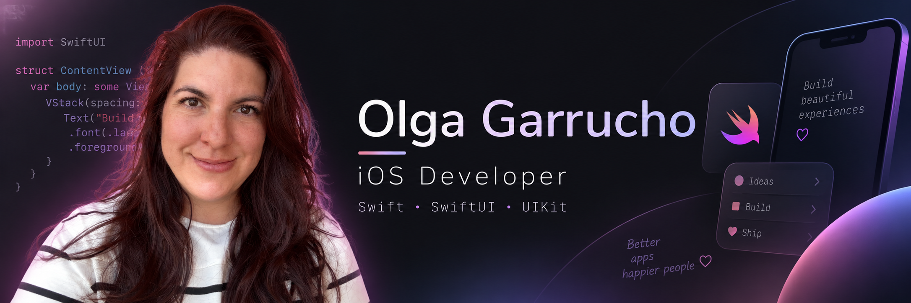

### <h2 align="left">🌸 Hi everyone!</h2>

I'm **Olga**, an **iOS Developer from Spain 🇪🇸**, originally from Cádiz and currently living in Madrid.

I've been working professionally as an iOS developer since **2022**, building and maintaining mobile applications using **Swift, SwiftUI and UIKit**.

I'm a creative and curious person who loves learning, solving problems and turning ideas into real products. What started as a career change into technology has become one of the things I enjoy the most: creating applications, improving user experiences and continuously learning new ways to build better software. 👩‍💻✨

---

### <h2 align="left">🌸 Tech stack</h2>

* **Swift**
* **SwiftUI**
* **UIKit**
* **MVVM · MVP · MVC · VIPER**
* **Combine · RxSwift**
* **Alamofire**
* **Firebase**
* **Core Data · Realm**
* **StoreKit / In-App Purchases**
* **PassKit & Apple Pay**
* **AdMob**
* **Unit Testing & UI Testing**
* **Git · GitHub · Bitbucket**

---

### <h2 align="left">🌸 What I'm currently working on</h2>

* Developing and maintaining professional **iOS applications**.
* Migrating and improving projects for **Swift 6** and modern Swift concurrency.
* Building my own mobile apps from idea to production.
* Working with **Firebase, monetization, subscriptions, widgets and App Store publishing**.
* Exploring how **AI can be integrated into real products and business tools**.

---

### <h2 align="left">🌸 Some of my projects</h2>

📱 **Mi Momento**
A mindfulness and personal wellbeing app built with SwiftUI, including daily reflections, gratitude, meditation, progress tracking, widgets and premium features.

🎭 **LieBusters**
A social party game for iOS and Android with hidden roles, impostors, categories and multiplayer game mechanics.

🎄 **Forever Christmas**
A Christmas-themed mobile experience with daily content, streaks, inspiration and gamification.

🎁 **Wish Gift**
An app for creating and sharing wish lists for birthdays, Christmas and special events.

---

### <h2 align="left">🌸 A little more about me</h2>

* 🐾 I love animals.
* 🧵 I'm passionate about DIY and especially sewing.
* 💡 I love creating things, whether it's an app, a design or a completely new project.
* 🏗️ Before becoming a developer, I studied **Building Engineering**.
* ♑ Capricorn.
* 🚀 I'm always thinking about the next project I want to build.

---

### <h2 align="left">🌸 Let's connect</h2>

* [GitHub](https://github.com/olgargarrucho)
* [LinkedIn](https://www.linkedin.com/in/olgargarrucho/)
* [Twitter / X](https://twitter.com/OlgaRGarrucho)
* [Email](mailto:olga_1847@hotmail.com)

###
